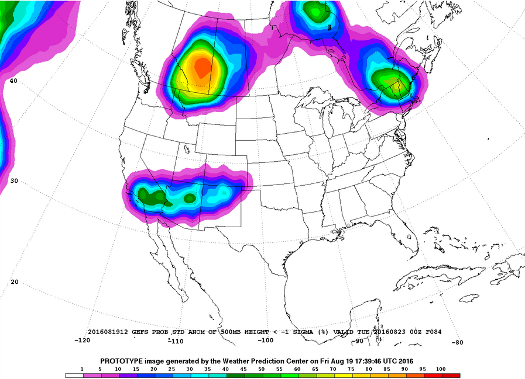

 
<i> Courtesy: NOAA </i>
  
This was a group project I had worked on as part of my graduate-level Machine Learning course. The goal was to predict the probability of rainfall at a location given a few attributes about that location (descriptions of these attributes were unknown).

The project report can be viewed/downloaded here:
<object data="/files/rainfall_report.pdf" type="application/pdf" width="360px" height="400px">
    <embed src="/files/rainfall_report.pdf">
        <i>This browser does not support embedded PDFs. Please download it here: </i><a href="/files/rainfall_report.pdf">Download report</a>
    </embed>
</object>
 
The (partial) code for this project can be viewed <a href="../files/rainfall_code.html">here</a>.
